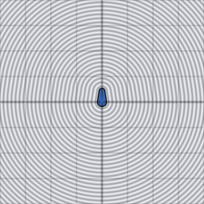

# d3_sdf_round_cone

Signed distance from a 3D point to a round cone (a sphere continuously
swept from radius `r1` to `r2` along a height `h`), axis along y. Like
`d3_sdf_capsule` but with differing end radii instead of equal ones.

## Visualization

Rendered via the chunk-preview harness's synthesized grayscale field —
no raymarcher or camera. The wrapper lifts each pixel into 3D as
`vec3f( p.x, p.y, 0.0 )` before calling `d3_sdf_round_cone( ·, 0.22,
0.08, 0.36 )`; since the axis runs along y with `p.xz` as the radial
plane, this `z = 0` slice is the *axial* profile. Raw value written
straight to `vec3f( value )`, clamped to `[0, 1]`, at `preview_scale =
8`. A tapered, teardrop-like silhouette narrowing from radius `0.22`
at `y = 0` to `0.08` at `y = 0.36` — smooth curvature throughout, no
sharp edges anywhere, unlike `d3_sdf_capped_cone`'s slice.

This demo is now wired in as a permanent `d3_sdf_round_cone_preview` export, so the chunk is directly previewable via `sch preview d3_sdf_round_cone` — no wrapper file needed.

## Parameters

| Field | Value |
|---|---|
| `name` | `d3_sdf_round_cone` |
| `description` | Signed distance from a 3D point to a round cone (swept sphere) of height h between radii r1 (bottom) and r2 (top), axis along y. |
| `tags` | `category:sdf, dim:3d` |
| `stage` | — (plain callable function, not an entry point) |
| `depends_on` | — (no dependencies; leaf chunk) |
| `export` | `fn d3_sdf_round_cone(p: vec3f, r1: f32, r2: f32, h: f32) -> f32`, `fn d3_sdf_round_cone_preview(p: vec2f, radius_bottom: f32, radius_top: f32, height: f32, z_slice: f32) -> f32` |

## Nuances

- Three regions (near the `r1` cap, near the `r2` cap, along the tapered
  side) are each handled by their own early-return branch — no single
  closed-form expression covers all three.
- `r1 == r2` degenerates to a plain cylinder-like capsule shape (still
  smoothly capped, unlike `d3_sdf_capped_cylinder`'s flat caps).
- Good default choice for organic/creature limb segments where
  `d3_sdf_capsule`'s equal end radii read as too mechanical.

## Relatives

- **Depends on:** none — leaf primitive.
- **Depended on by:** none yet.
- **Collection index:** [shader/](../readme.md)
- **Bundled by:** [`shader_chunks_core`](../../module/shader/shader_chunks_core/readme.md)
- **Inspect/compose via CLI:** [`shader_chunks`](../../module/shader/shader_chunks/readme.md)
  (`sch get d3_sdf_round_cone`, `sch tree d3_sdf_round_cone`)
- **Consumers:** none yet.
