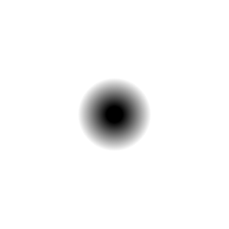

# d3_sdf_sphere

Signed distance from a 3D point to a sphere of the given radius: negative
inside, zero on the boundary, positive outside. The 3D counterpart of
`d2_sdf_circle` — the base primitive for raymarched scenes.

## Visualization

Rendered via the chunk-preview harness's synthesized grayscale field —
there is no raymarcher or camera; the harness only ever samples a flat
2D plane. The wrapper lifts each pixel's `p : vec2f` into 3D as
`vec3f( p, 0.0 )` (a slice through the shape's center on `z = 0`) before
calling `d3_sdf_sphere( ·, 0.28 )`, and the raw signed-distance value is
written straight to `vec3f( value )`, clamped to `[0, 1]`, at
`preview_scale = 8`. A `z = 0` slice through a sphere's center is exactly
a circle, so the field is visually identical to `d2_sdf_circle`'s.

This demo is now wired in as a permanent `d3_sdf_sphere_preview` export, so the chunk is directly previewable via `sch preview d3_sdf_sphere` — no wrapper file needed.

## Parameters

| Field | Value |
|---|---|
| `name` | `d3_sdf_sphere` |
| `description` | Signed distance from a 3D point to a sphere of the given radius. |
| `tags` | `category:sdf, dim:3d` |
| `stage` | — (plain callable function, not an entry point) |
| `depends_on` | — (no dependencies; leaf chunk) |
| `export` | `fn d3_sdf_sphere(p: vec3f, radius: f32) -> f32`, `fn d3_sdf_sphere_preview(p: vec2f) -> f32` |

## Nuances

- Exact euclidean distance — safe as a raymarch step size without
  correction, same guarantee `d2_sdf_circle` gives in 2D.
- Centered at the origin: translate by subtracting the center from `p`.
- The simplest possible building block for `sdf_op_union`/`sdf_op_subtract`
  compositions — combine two spheres to sanity-check an operator chunk.

## Relatives

- **Depends on:** none — leaf primitive.
- **Depended on by:** none yet.
- **Collection index:** [shader/](../readme.md)
- **Bundled by:** [`shader_chunks_core`](../../module/shader/shader_chunks_core/readme.md)
- **Inspect/compose via CLI:** [`shader_chunks`](../../module/shader/shader_chunks/readme.md)
  (`sch get d3_sdf_sphere`, `sch tree d3_sdf_sphere`)
- **Consumers:** none yet.
