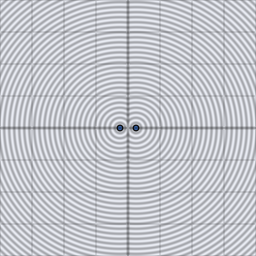

# d3_sdf_torus

Signed distance from a 3D point to a torus (donut) with major and tube
radii given by `t`, ring lying in the xz-plane around the y-axis.

## Visualization

Rendered via the chunk-preview harness's synthesized grayscale field —
no raymarcher or camera. The wrapper lifts each pixel into 3D as
`vec3f( p.x, p.y, 0.0 )` before calling `d3_sdf_torus( ·, vec2f( 0.22,
0.08 ) )`; since the ring lies in the xz-plane, this `z = 0` slice is an
*axial* cross-section along the torus's own radial axis, not a face-on
view. Raw value written straight to `vec3f( value )`, clamped to
`[0, 1]`, at `preview_scale = 8`. Two separate dark lobes appear at
`x = ±0.22` — the tube's two walls — with a lighter seam between them
where the "hole" would be; there is no single connected disk.

This demo is now wired in as a permanent `d3_sdf_torus_preview` export, so the chunk is directly previewable via `sch preview d3_sdf_torus` — no wrapper file needed.

## Parameters

| Field | Value |
|---|---|
| `name` | `d3_sdf_torus` |
| `description` | Signed distance from a 3D point to a torus with major and tube radii t, ring in the xz-plane. |
| `tags` | `category:sdf, dim:3d` |
| `stage` | — (plain callable function, not an entry point) |
| `depends_on` | — (no dependencies; leaf chunk) |
| `export` | `fn d3_sdf_torus(p: vec3f, t: vec2f) -> f32`, `fn d3_sdf_torus_preview(p: vec2f, major_radius: f32, tube_radius: f32, z_slice: f32) -> f32` |

## Nuances

- `t.x` (major radius) must exceed `t.y` (tube radius) — otherwise the
  tube self-intersects at the center and the shape degenerates.
- Reduces to a 2D problem: `length(p.xz)` collapses the ring to a single
  radial coordinate, then it's exactly `d2_sdf_ring`'s distance-to-circle-line
  logic in the `( radial, y )` plane.
- Axis fixed to y — rotate `p` for any other ring-plane orientation.

## Relatives

- **Depends on:** none — leaf primitive.
- **Depended on by:** none yet.
- **Collection index:** [shader/](../readme.md)
- **Bundled by:** [`shader_chunks_core`](../../module/shader/shader_chunks_core/readme.md)
- **Inspect/compose via CLI:** [`shader_chunks`](../../module/shader/shader_chunks/readme.md)
  (`sch get d3_sdf_torus`, `sch tree d3_sdf_torus`)
- **Consumers:** none yet.
