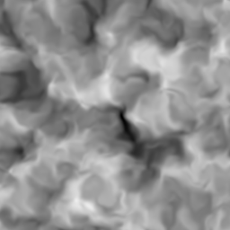

# domain_warp

Warps a 2D point by two centered [`fbm3`](../fbm3/readme.md) offsets for
organic distortion. Feed the warped point into any noise (or into `fbm3`
again) and straight lattice artifacts dissolve into flowing, marbled,
smoke-like structure — the classic "noise of warped coordinates" trick.

## Visualization

Rendered via the chunk-preview harness's synthesized grayscale
field: `fbm3( domain_warp( p, 0.75, lacunarity, gain, seed ), lacunarity,
gain ) / fbm_max` — plain fbm sampled through the warp, normalized by
fbm3's own (now `gain`-dependent) maximum — is written straight to
`vec3f( value )`, clamped to `[0, 1]`, at `preview_scale = 8`. Compare with
the `fbm3` preview: same field, but the blobs are smeared into curved
filaments. `lacunarity`/`gain` reshape both the warp and the warped field
together (see Nuances below); `seed` reshuffles the warp pattern alone,
leaving the unwarped base field untouched. Directly previewable via
`sch preview domain_warp`.

## Parameters

| Field | Value |
|---|---|
| `name` | `domain_warp` |
| `description` | Warps a 2D point by two centered fbm3 offsets for organic distortion. |
| `tags` | `category:noise`, `technique:warp` |
| `stage` | — (plain callable function, not an entry point) |
| `depends_on` | `fbm3` |
| `export` | `fn domain_warp(p: vec2f, strength: f32, lacunarity: f32, gain: f32, seed: f32) -> vec2f`, `fn domain_warp_preview(p: vec2f, strength: f32, lacunarity: f32, gain: f32, seed: f32) -> f32` |

## Nuances

- The two offset channels are the same `fbm3` sampled at `p` and at
  `p + ( 5.2, 1.3 ) + seed` — a fixed decorrelation shift (per Quilez's
  domain warping article) plus a caller-tunable one, cheaper than a
  dedicated vector-valued fbm.
- `lacunarity` (`//@ param:`, range `[1, 3]`, default `2.0`) and `gain`
  (`//@ param:`, range `[0, 1]`, default `0.5`) forward straight through to
  both underlying `fbm3` reads — this chunk has no octave structure of its
  own to tune. Both defaults (this range's midpoint in each case) reproduce
  the original, pre-parameter warp exactly.
- `seed` (`//@ param:`, range `[-50, 50]`, default `0`) offsets only the
  *second* `fbm3` read's sample point, reshuffling which warp pattern pairs
  with the first (unwarped-offset) read; `p` itself and the first read are
  untouched, so `seed` changes the warp's character without moving the
  overall field. `0` (this range's midpoint) reproduces the original,
  unseeded `( 5.2, 1.3 )` offset exactly — `vec2f + f32` broadcasts
  per-component in WGSL, so adding a scalar `seed` to a `vec2f` offset is
  valid without a manual `vec2f( seed, seed )` construction.
- `fbm3` now outputs `[0, fbm_max]` where `fbm_max = 0.5 * ( 1 + gain +
  gain² )` (`0.875` at the default `gain = 0.5`, this chunk's original
  fixed constant); the `* ( 2.0 / fbm_max ) - 1` remap recenters that to
  `[-1, 1]` for any `gain`, so the warp stays unbiased — `strength` never
  drags the whole field diagonally regardless of `gain`.
- `strength` is in input-space units: the returned point moves at most
  `strength · √2` away from `p`. Values around `0.3–1.0` at unit scale
  read as "organic"; much larger turns to mush.
- Warping is composable: `domain_warp` of `domain_warp` gives the deeply
  folded two-level look at double the (already 3-octave) cost.

## Relatives

- **Depends on:** [`fbm3`](../fbm3/readme.md) (both warp channels), which
  pulls in `value_noise` and `hash21` transitively.
- **Depended on by:** none yet.
- **Collection index:** [shader/](../readme.md)
- **Bundled by:** [`shader_chunks_core`](../../module/shader/shader_chunks_core/readme.md)
- **Inspect/compose via CLI:** [`shader_chunks`](../../module/shader/shader_chunks/readme.md)
  (`sch get domain_warp`, `sch tree domain_warp`)
- **Consumers:** none yet.
