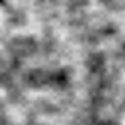

# fbm3

Fixed 3-octave fractal Brownian motion built on `value_noise`, in
`[0, 0.875]`.

## Visualization

256×256, evaluated over the same continuous domain as
[`value_noise`](../value_noise/readme.md) (`[0, 8) × [0, 8)`, 32 px per unit
cell at octave 1), mapped to grayscale. The raw output's theoretical range
is `[0, 0.875]` (see Nuances below); the preview divides by `0.875` so the
image uses the full display contrast range — a property of *this preview
only*, not of the shader, which never rescales its own output. Compare
against `value_noise`'s preview: `fbm3` layers three progressively
finer/fainter copies of the same noise, giving visibly richer, more
fractal-looking detail than a single `value_noise` octave.

## Parameters

| Field | Value |
|---|---|
| `name` | `fbm3` |
| `description` | Fixed 3-octave fractal Brownian motion built on `value_noise`, in `[0, 0.875]`. |
| `tags` | `category:noise`, `technique:fractal` |
| `stage` | — (plain callable function, not an entry point) |
| `depends_on` | `value_noise` |
| `export` | `fn fbm3(p: vec2f) -> f32` |

## Nuances

- Standard fractal-Brownian-motion construction: 3 octaves, each one
  doubling frequency (`p *= 2.0`) while halving amplitude relative to the
  previous octave (`0.5`, `0.25`, `0.125`).
- Fixed at exactly 3 octaves — not parameterized by an octave count. The
  name encodes this directly (`fbm3`, not a generic `fbm(p, octaves)`); a
  4th octave would need a new chunk (e.g. `fbm4`), not a parameter to this
  one.
- The three amplitudes sum to `0.875`, so `0.875` is this function's
  theoretical maximum, not `1.0` — already documented in its own `//@
  description:` line, and the reason the preview above rescales by `0.875`
  for display contrast.
- Reuses [`value_noise`](../value_noise/readme.md) (and transitively
  [`hash21`](../hash21/readme.md)) for every octave — no separate hashing
  primitive is introduced at this layer.

## Relatives

- **Depends on:** [`value_noise`](../value_noise/readme.md) (called three
  times, at increasing frequency and decreasing amplitude).
- **Depended on by:** [`domain_warp`](../domain_warp/readme.md) (samples
  it twice for the warp offsets); also consumed directly by downstream
  fragment shaders (e.g. `examples/orrery/webgpu`'s
  `shader/scene_fragment.wgsl`).
- **Collection index:** [shader/](../readme.md)
- **Bundled by:** [`shader_chunks_core`](../../module/shader/shader_chunks_core/readme.md)
- **Inspect/compose via CLI:** [`shader_chunks`](../../module/shader/shader_chunks/readme.md)
  (`sch get fbm3`, `sch tree fbm3`)
- **Consumer:** [`examples/orrery/webgpu`](../../examples/orrery/webgpu/readme.md)
