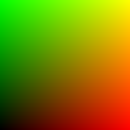

# fullscreen_triangle

Fullscreen-triangle vertex stage: 3 vertices, no vertex buffer,
`vertex_index` alone picks the corner.

## Visualization

Unlike the other three chunks, this one has no numeric output to plot — it
is a `@vertex` entry point, not a callable function. The image instead shows
the interpolated `uv` value actually rasterized across the visible viewport
(256×256, red channel = `uv.x`, green channel = `uv.y`, `uv = (0,0)` at
bottom-left, `uv = (1,1)` at top-right). This is exactly what any fragment
shader paired with this vertex stage receives per-pixel in
`VertexOutput.uv` — a plain, screen-linear gradient covering the full unit
square with no distortion.

## Parameters

| Field | Value |
|---|---|
| `name` | `fullscreen_triangle` |
| `description` | Fullscreen-triangle vertex stage: 3 vertices, no vertex buffer, `vertex_index` alone picks the corner. |
| `tags` | `category:vertex` |
| `stage` | `vertex` |
| `depends_on` | — (no dependencies; standalone entry point) |
| `export` | `struct VertexOutput { position: vec4f, uv: vec2f }`, `fn vs_main(vertex_index: u32) -> VertexOutput` |

## Nuances

- The "big triangle" trick: draw exactly 3 vertices with **no** vertex or
  index buffer bound; `vertex_index` (`0`, `1`, `2`) alone picks each corner
  via `vertex_index & 1` / `vertex_index / 2` bit tricks.
- The resulting triangle deliberately **overshoots** clip space (its
  far corners land outside the `[-1, 1]` NDC range) — only the visible unit
  square of `uv` (`(0,0)` bottom-left to `(1,1)` top-right) is ever
  rasterized to actual pixels; the GPU clips the overshoot away for free.
  This is why the visualization above shows a plain gradient with no visible
  triangle edge — the edge is entirely off-screen by construction.
- This trades a small amount of wasted rasterization work outside the
  viewport for avoiding the more common "two-triangle fullscreen quad"
  approach (4-6 vertices, sometimes a real vertex buffer) — a standard,
  well-known technique, not specific to this codebase.
- Unlike the other three chunks (plain callable functions), this chunk is a
  `stage: vertex` entry point and cannot itself be part of a fragment-only
  composition. A consumer's own fragment shader must declare its own
  `fn fs_main(in: VertexOutput) -> @location(0) vec4f`, consuming this
  chunk's exported `VertexOutput` and reading `in.uv` — see
  `examples/orrery/webgpu`'s `shader/scene_fragment.wgsl` for a worked
  example.

## Relatives

- **Depends on:** none — standalone entry point.
- **Depended on by:** none within this collection (no other bundled chunk
  calls into a vertex stage); consumed directly by downstream fragment
  shaders that need a viewport-covering triangle plus `uv`.
- **Collection index:** [shader/](../readme.md)
- **Bundled by:** [`shader_chunks_core`](../../module/shader/shader_chunks_core/readme.md)
- **Inspect/compose via CLI:** [`shader_chunks`](../../module/shader/shader_chunks/readme.md)
  (`sch get fullscreen_triangle`, `sch tree fullscreen_triangle`)
- **Consumer:** [`examples/orrery/webgpu`](../../examples/orrery/webgpu/readme.md)
