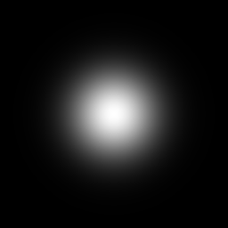

# gaussian_weight

Unnormalized 1D Gaussian weight for an offset at the given sigma:
`exp( -x² / 2σ² )`. The kernel term for separable blurs — callers sum the
weights over their taps and divide by that sum, the same pattern the GLSL
renderer's `filters/gaussian.frag` uses.

## Visualization

Rendered via the chunk-preview harness's synthesized grayscale
field: `gaussian_weight( length( p ), 1.0 )`'s value is written
straight to `vec3f( value )`, clamped to `[0, 1]`, at
`preview_scale = 8` — a soft bell-shaped blob, bright center fading
through the classic Gaussian shoulders. Directly previewable via
`sch preview gaussian_weight`.

## Parameters

| Field | Value |
|---|---|
| `name` | `gaussian_weight` |
| `description` | Unnormalized 1D Gaussian weight for an offset at the given sigma. |
| `tags` | `category:filter` |
| `stage` | — (plain callable function, not an entry point) |
| `depends_on` | — (no dependencies; leaf chunk) |
| `export` | `fn gaussian_weight(x: f32, sigma: f32) -> f32`, `fn gaussian_weight_preview(p: vec2f) -> f32` |

## Nuances

- Deliberately **unnormalized** — no `1 / ( σ √2π )` factor. A finite-tap
  kernel must renormalize by the *actual* sum of its sampled weights
  anyway (the analytic factor is only exact for the infinite continuous
  kernel), so the correct pattern is also the cheaper one: accumulate
  `weight * sample` and `weight`, divide once at the end.
- `x` and `sigma` share whatever unit the caller picks (pixels, uv, world
  units) — only their ratio matters.
- Practical kernel radius is ~`3σ`: beyond that the weight drops under
  1 %, so taps stop paying for themselves.
- Symmetric in `x`, so a separable blur can evaluate each weight once per
  `|offset|` and reuse it for the ± pair.

## Relatives

- **Depends on:** none — leaf primitive.
- **Depended on by:** none yet.
- **Collection index:** [shader/](../readme.md)
- **Bundled by:** [`shader_chunks_core`](../../module/shader/shader_chunks_core/readme.md)
- **Inspect/compose via CLI:** [`shader_chunks`](../../module/shader/shader_chunks/readme.md)
  (`sch get gaussian_weight`, `sch tree gaussian_weight`)
- **Consumers:** none yet — the WGSL twin of the weight function inside
  the GLSL renderer's `filters/gaussian.frag`.
