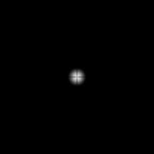

# glow

Analytic radial falloff: 1 at distance 0 fading smoothly to 0 at the given
radius. The single most repeated inline idiom in the orrery scene shaders
— star halos, planet cores, node flicker are all this one-liner with
hand-tuned constants — extracted into a named, reusable form.

## Visualization

Rendered via the chunk-preview harness's synthesized grayscale
field: `glow( length( p ), 0.4 )`'s raw value is written straight
to `vec3f( value )`, clamped to `[0, 1]`, at `preview_scale = 8` —
a soft radial falloff centered on the frame. Directly previewable
via `sch preview glow`.

## Parameters

| Field | Value |
|---|---|
| `name` | `glow` |
| `description` | Analytic radial falloff: 1 at distance 0 fading to 0 at the given radius. |
| `tags` | `category:shading` |
| `stage` | — (plain callable function, not an entry point) |
| `depends_on` | — (no dependencies; leaf chunk) |
| `export` | `fn glow(d: f32, radius: f32) -> f32`, `fn glow_preview(p: vec2f, radius: f32) -> f32` |

## Nuances

- Input is a *distance*, not a point — pair it with `length(...)` or any
  sdf chunk's output, which is what keeps it shape-agnostic.
- `smoothstep( radius, 0.0, d )` with reversed edges: zero first and
  second-derivative-flat at both ends, so stacked glows never show hard
  rims. Distances beyond `radius` clamp to exactly 0 — safe to sum many
  glows without accumulating background haze.
- This is an analytic *substitute* for bloom, not the real thing: it
  radiates only from where you evaluate it, is not energy-conserving, and
  knows nothing about the scene's actual brightness. For emissive
  geometry it is far cheaper than a blur chain and usually good enough.

## Relatives

- **Depends on:** none — leaf primitive.
- **Depended on by:** none yet.
- **Collection index:** [shader/](../readme.md)
- **Bundled by:** [`shader_chunks_core`](../../module/shader/shader_chunks_core/readme.md)
- **Inspect/compose via CLI:** [`shader_chunks`](../../module/shader/shader_chunks/readme.md)
  (`sch get glow`, `sch tree glow`)
- **Consumers:** none yet — the orrery scene's inline falloffs are the
  intended adoption site.
