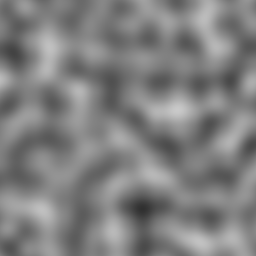

# gradient_noise

Quintic-faded gradient (Perlin) noise at a 2D point, roughly in
`[-0.7, 0.7]`. Where [`value_noise`](../value_noise/readme.md) blends
random *values* at cell corners, this blends random *directions* — the
result is smoother, less grid-locked, and centered on zero, which is the
natural shape for displacement and flow fields.

## Visualization

256×256, `gradient_noise( in.uv * 8.0 ) * 0.5 + 0.5` mapped to grayscale —
8 lattice cells across, remapped from the centered range into `[0, 1]` for
display. Compared with the `value_noise` preview at the same scale, the
blobs are rounder and the underlying grid is much harder to spot.

## Parameters

| Field | Value |
|---|---|
| `name` | `gradient_noise` |
| `description` | Quintic-faded gradient (Perlin) noise at a 2D point, roughly in `[-0.7, 0.7]`. |
| `tags` | `category:noise`, `technique:gradient` |
| `stage` | — (plain callable function, not an entry point) |
| `depends_on` | `hash22` |
| `export` | `fn gradient_noise(p: vec2f) -> f32` |

## Nuances

- Quintic fade `f³ ( f ( 6f - 15 ) + 10 )`, not the cubic smoothstep the
  value-noise chunks use: gradient noise shows visible creasing at cell
  borders unless both first *and* second derivatives vanish there, which
  only the quintic provides.
- Corner gradients are `hash22` output remapped to `[-1, 1)²` and left
  unnormalized — the standard cheap variant. That's why the output range
  is "roughly ±0.7" rather than exactly ±1; if a strict range matters,
  scale the result rather than assuming unit amplitude.
- Output is **centered on 0**, unlike the `[0, 1)` value-noise chunks —
  remap with `* 0.5 + 0.5` before using it as a color, or use it directly
  as a signed offset.

## Relatives

- **Depends on:** [`hash22`](../hash22/readme.md) (per-corner random
  gradients).
- **Depended on by:** none yet.
- **Collection index:** [shader/](../readme.md)
- **Bundled by:** [`shader_chunks_core`](../../module/shader/shader_chunks_core/readme.md)
- **Inspect/compose via CLI:** [`shader_chunks`](../../module/shader/shader_chunks/readme.md)
  (`sch get gradient_noise`, `sch tree gradient_noise`)
- **Consumers:** none yet.
