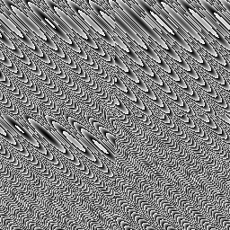

# hash13

Single-value hash of a 3D point into `[0, 1)`. The 3D-lattice primitive:
[`value_noise3`](../value_noise3/readme.md) hashes its eight cell corners
with this, the same way `value_noise` leans on `hash21` in 2D.

## Visualization

Rendered via the chunk-preview harness's synthesized grayscale field:
`hash13( vec3f( p, 42.0 ) )` — a fixed `z = 42` slice — is written straight
to `vec3f( value )`, clamped to `[0, 1]`, at `preview_scale = 8`. Pure
static; a different `z` yields entirely different static. Directly
previewable via `sch preview hash13`.

## Parameters

| Field | Value |
|---|---|
| `name` | `hash13` |
| `description` | Single-value hash of a 3D point into `[0, 1)`. |
| `tags` | `category:hash` |
| `stage` | — (plain callable function, not an entry point) |
| `depends_on` | — (no dependencies; leaf chunk) |
| `export` | `fn hash13(p: vec3f) -> f32`, `fn hash13_preview(p: vec2f) -> f32` |

## Nuances

- Same hash-without-sine construction as the 2D hashes, but with the
  `31.32` cross-term constant and a `.zyx` swizzle — the canonical
  3D-input/1D-output member of the family, not an ad-hoc variation.
- No lattice quantization inside: it hashes whatever continuous `p` it is
  given; `value_noise3` is what calls it at `floor`ed corner coordinates.
- Pure and stateless — no seed, no global state.

## Relatives

- **Depends on:** none — leaf hash primitive.
- **Depended on by:** [`value_noise3`](../value_noise3/readme.md) (hashes
  the eight lattice corners around each 3D sample point).
- **Collection index:** [shader/](../readme.md)
- **Bundled by:** [`shader_chunks_core`](../../module/shader/shader_chunks_core/readme.md)
- **Inspect/compose via CLI:** [`shader_chunks`](../../module/shader/shader_chunks/readme.md)
  (`sch get hash13`, `sch tree hash13`)
- **Consumers:** none yet.
