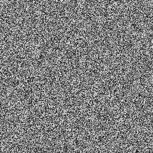

# hash21

Single-value hash of a 2D point into `[0, 1)`. The hash primitive every
other noise chunk in this collection builds on.

## Visualization

256×256, one `hash21` evaluation per integer pixel coordinate (`p = (x, y)`
for `x, y` in `[0, 256)`, one point per pixel, mapped to grayscale). The
result is pure "TV static" with no spatial coherence between neighboring
pixels — this is the *correct*, expected look for a hash function, and is
exactly why [`value_noise`](../value_noise/readme.md) exists as a separate
chunk: to add spatial coherence on top of this.

## Parameters

| Field | Value |
|---|---|
| `name` | `hash21` |
| `description` | Single-value hash of a 2D point into `[0, 1)`. |
| `tags` | `category:hash` |
| `stage` | — (plain callable function, not an entry point) |
| `depends_on` | — (no dependencies; leaf chunk) |
| `export` | `fn hash21(p: vec2f) -> f32` |

## Nuances

- The magic constants `0.1031` and `33.33` are arbitrary, deliberately
  non-round values chosen to avoid periodicity — the standard
  "hash-without-sine" construction (no `sin`/`cos` calls, which are
  precision-fragile and slow on some GPUs).
- The initial `vec3f( p.x, p.y, p.x )` reuses `p.x` in two of the three
  lanes on purpose: it folds the x-component into the cross terms of the
  later `dot( p3, p3.yzx + 33.33 )` mix, which breaks the axis-aligned
  symmetry a naive `(p.x, p.y, 0)` would otherwise leave visible as faint
  horizontal/vertical banding.
- Pure and stateless: the same `p` always returns the same value — no seed,
  no global state, safe to call from any invocation in parallel.
- `hash21` itself does **not** quantize its input to a lattice — it hashes
  whatever continuous `p` it's given. [`value_noise`](../value_noise/readme.md)
  is what calls it at integer lattice corners (`floor(p)` and its three
  neighbors); the preview above instead calls it directly at consecutive
  integer coordinates, which is what produces the uncorrelated static look.

## Relatives

- **Depends on:** none — this is the leaf hash primitive.
- **Depended on by:** [`value_noise`](../value_noise/readme.md) (hashes the
  four lattice corners around each sample point).
- **Collection index:** [shader/](../readme.md)
- **Bundled by:** [`shader_chunks_core`](../../module/shader/shader_chunks_core/readme.md)
- **Inspect/compose via CLI:** [`shader_chunks`](../../module/shader/shader_chunks/readme.md)
  (`sch get hash21`, `sch tree hash21`)
- **Consumer:** [`examples/orrery/webgpu`](../../examples/orrery/webgpu/readme.md)
