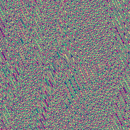

# hash22

Two-channel hash of a 2D point, each channel in `[0, 1)`. The vector
companion to [`hash21`](../hash21/readme.md): where that chunk yields one
pseudo-random value per point, this one yields two decorrelated values —
the shape needed for per-corner gradients and feature-point jitter.

## Visualization

Rendered via the chunk-preview harness's synthesized field: `hash22( p )`
is evaluated directly — no wrapper needed, its native `vec2f → vec2f`
shape matches the harness's Vec2 mode — with the two output channels
mapped to red/green (blue held at a fixed `0.5` pad), at
`preview_scale = 8`. Uncorrelated two-channel static — the correct look
for a hash. Directly previewable via `sch preview hash22`.

## Parameters

| Field | Value |
|---|---|
| `name` | `hash22` |
| `description` | Two-channel hash of a 2D point, each channel in `[0, 1)`. |
| `tags` | `category:hash` |
| `stage` | — (plain callable function, not an entry point) |
| `depends_on` | — (no dependencies; leaf chunk) |
| `export` | `fn hash22(p: vec2f) -> vec2f` |

## Nuances

- Same "hash-without-sine" family as `hash21` (no `sin`/`cos`, precision-
  stable on GPU): the `33.33` cross-term constant is shared, while the
  per-lane multipliers `0.1031 / 0.1030 / 0.0973` differ per lane, which is
  what decorrelates the two output channels from each other.
- The final swizzle pairing (`p3.xx + p3.yz` times `p3.zy`) mixes every
  lane into both outputs — neither channel is a plain copy of the other's
  construction.
- Pure and stateless: the same `p` always returns the same pair — safe to
  call from any invocation in parallel.

## Relatives

- **Depends on:** none — leaf hash primitive.
- **Depended on by:** [`gradient_noise`](../gradient_noise/readme.md)
  (per-corner gradients), [`voronoi`](../voronoi/readme.md) (per-cell
  feature-point jitter).
- **Collection index:** [shader/](../readme.md)
- **Bundled by:** [`shader_chunks_core`](../../module/shader/shader_chunks_core/readme.md)
- **Inspect/compose via CLI:** [`shader_chunks`](../../module/shader/shader_chunks/readme.md)
  (`sch get hash22`, `sch tree hash22`)
- **Consumers:** none yet.
