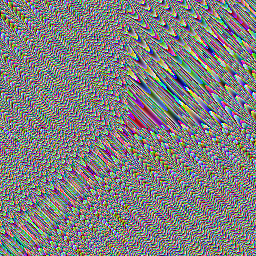

# hash33

Three-channel hash of a 3D point, each channel in `[0, 1)`. Completes the
hash family's vector row: per-corner 3D gradients or 3D feature-point
jitter — the shape a future 3D gradient or 3D cellular noise chunk will
hash its lattice with.

## Visualization

Rendered via the chunk-preview harness's synthesized field:
`hash33( vec3f( p, 42.0 ) )` — a fixed `z = 42` slice — is written directly
as RGB, clamped to `[0, 1]` by the render target, at `preview_scale = 8`.
Uncorrelated color static — no channel tracks another. Directly
previewable via `sch preview hash33`.

## Parameters

| Field | Value |
|---|---|
| `name` | `hash33` |
| `description` | Three-channel hash of a 3D point, each channel in `[0, 1)`. |
| `tags` | `category:hash` |
| `stage` | — (plain callable function, not an entry point) |
| `depends_on` | — (no dependencies; leaf chunk) |
| `export` | `fn hash33(p: vec3f) -> vec3f`, `fn hash33_preview(p: vec2f) -> vec3f` |

## Nuances

- Same hash-without-sine family: per-lane multipliers
  `0.1031 / 0.1030 / 0.0973` plus the `33.33` cross term; the `.yxz` input
  swizzle and the `.xxy / .yxx / .zyx` output pairing spread every input
  lane into every output channel.
- Pure and stateless — the same `p` always returns the same triple.

## Relatives

- **Depends on:** none — leaf hash primitive.
- **Depended on by:** none yet — added as the 3D vector rung of the hash
  ladder for 3D gradient/cellular noise to build on.
- **Collection index:** [shader/](../readme.md)
- **Bundled by:** [`shader_chunks_core`](../../module/shader/shader_chunks_core/readme.md)
- **Inspect/compose via CLI:** [`shader_chunks`](../../module/shader/shader_chunks/readme.md)
  (`sch get hash33`, `sch tree hash33`)
- **Consumers:** none yet.
