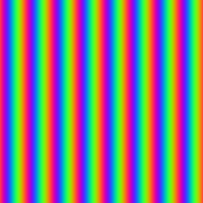

# palette_cosine

Cosine color palette: `a + b * cos( 2π ( c t + d ) )`, the classic
4-parameter gradient (Iñigo Quilez). One `cos` sweeps a full smooth color
ramp from four `vec3f` knobs — offset, amplitude, frequency, phase — with
no texture lookup and no branch.

## Visualization

Rendered via the chunk-preview harness's synthesized field:
`palette_cosine( p.x, a, b, c, d )` through the canonical rainbow
parameterization (`a = b = vec3f(0.5)`, `c = vec3f(1.0)`,
`d = vec3f(0.0, 0.33, 0.67)`) is written directly as RGB, clamped to
`[0, 1]`, at `preview_scale = 8`. Since `p.x` sweeps a wider range than a
fixed `0..1` ramp, the harness view shows the rainbow repeating — the
phase vector `d` is still what spreads the three channels a third of a
cycle apart. Directly previewable via `sch preview palette_cosine`.

## Parameters

| Field | Value |
|---|---|
| `name` | `palette_cosine` |
| `description` | Cosine color palette: a + b*cos(2pi*(c*t + d)), the classic 4-parameter gradient. |
| `tags` | `category:color` |
| `stage` | — (plain callable function, not an entry point) |
| `depends_on` | — (no dependencies; leaf chunk) |
| `export` | `fn palette_cosine(t: f32, a: vec3f, b: vec3f, c: vec3f, d: vec3f) -> vec3f`, `fn palette_cosine_preview(p: vec2f, base: f32, amplitude: f32, frequency: f32, phase_r: f32, phase_g: f32, phase_b: f32) -> vec3f` |

## Nuances

- `c` and `d` are in **cycles**, not radians — the `2π` lives inside the
  function. `c = ( 1.0 )` means exactly one full color loop over
  `t ∈ [0, 1]`, and the palette tiles seamlessly for any integer `c`.
- Output is only guaranteed inside `[0, 1]` when `a ± b` stays there
  (e.g. the canonical `a = b = ( 0.5 )`); more adventurous parameters can
  overshoot — clamp before writing to an 8-bit target if so.
- `t` is deliberately unclamped: feeding noise, distance, or time straight
  in wraps naturally thanks to the cosine.
- Ready-made parameter sets worth stealing live in Quilez's palettes
  article (<https://iquilezles.org/articles/palettes/>).

## Relatives

- **Depends on:** none — leaf primitive.
- **Depended on by:** none yet.
- **Collection index:** [shader/](../readme.md)
- **Bundled by:** [`shader_chunks_core`](../../module/shader/shader_chunks_core/readme.md)
- **Inspect/compose via CLI:** [`shader_chunks`](../../module/shader/shader_chunks/readme.md)
  (`sch get palette_cosine`, `sch tree palette_cosine`)
- **Consumers:** none yet.
