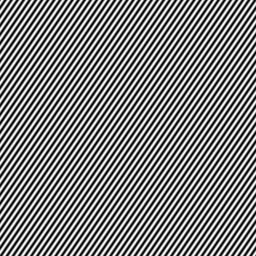

# rot2

2D rotation matrix for the given angle in radians, counterclockwise.
Angular placement without scattering `cos`/`sin` pairs through shader
bodies: orbit positions, spinner phases, rotated pattern spaces.

## Visualization

Rendered via the chunk-preview harness's synthesized grayscale
field: `q = rot2( 0.6 ) * p`, shaded by
`0.5 + 0.5 * cos( q.x * 40.0 )` — cosine stripes across the rotated
frame — written straight to `vec3f( value )`, clamped to `[0, 1]`,
at `preview_scale = 8`. Directly previewable via `sch preview rot2`.

## Parameters

| Field | Value |
|---|---|
| `name` | `rot2` |
| `description` | 2D rotation matrix for the given angle in radians, counterclockwise. |
| `tags` | `category:transform` |
| `stage` | — (plain callable function, not an entry point) |
| `depends_on` | — (no dependencies; leaf chunk) |
| `export` | `fn rot2(angle: f32) -> mat2x2f`, `fn rot2_preview(p: vec2f) -> f32` |

## Nuances

- WGSL matrix constructors take **columns**: the body's
  `mat2x2f( vec2f( c, s ), vec2f( -s, c ) )` is the standard CCW rotation
  for `rot2( a ) * v` — easy to mis-read as row-major and accidentally
  transpose.
- The inverse rotation is free: rotation matrices are orthogonal, so use
  `transpose( m )` or simply `rot2( -angle )` — never a general inverse.
- Rotation is about the origin; for any other pivot, subtract the pivot,
  rotate, add it back (the preview rotates about `uv = ( 0.5, 0.5 )` this
  way).
- Build once per fragment and reuse when rotating several vectors by the
  same angle — one `cos`/`sin` pair instead of many.

## Relatives

- **Depends on:** none — leaf primitive.
- **Depended on by:** none yet.
- **Collection index:** [shader/](../readme.md)
- **Bundled by:** [`shader_chunks_core`](../../module/shader/shader_chunks_core/readme.md)
- **Inspect/compose via CLI:** [`shader_chunks`](../../module/shader/shader_chunks/readme.md)
  (`sch get rot2`, `sch tree rot2`)
- **Consumers:** none yet.
