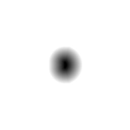

# sdf_op_intersect

Sharp intersection of two signed distances: the farther surface wins
everywhere, keeping only the region inside both shapes. Dimension-agnostic,
like every `sdf_op_*` chunk.

## Visualization

Rendered via the chunk-preview harness's synthesized grayscale field —
the same `d2_sdf_circle` (radius `0.22`, centered at `x = -0.13`) /
`d2_sdf_box` (half-extents `0.16`, centered at `x = 0.15`) input pair
as the `sdf_op_union` preview, composed with `sdf_op_intersect` instead.
Raw result written straight to `vec3f( value )`, clamped to `[0, 1]`,
at `preview_scale = 8`. Only the lens-shaped overlap between the circle
and the box remains solid black; everything either shape alone covered
is gone.

This demo is now wired in as a permanent `sdf_op_intersect_preview` export, so the chunk is directly previewable via `sch preview sdf_op_intersect` — no wrapper file needed.

## Parameters

| Field | Value |
|---|---|
| `name` | `sdf_op_intersect` |
| `description` | Sharp intersection of two signed distances — the farther surface wins. |
| `tags` | `category:sdf, technique:operator` |
| `stage` | — (plain callable function, not an entry point) |
| `depends_on` | `d2_sdf_circle`, `d2_sdf_box` |
| `export` | `fn sdf_op_intersect(d1: f32, d2: f32) -> f32`, `fn sdf_op_intersect_preview(p: vec2f) -> f32` |

## Nuances

- `max` instead of `sdf_op_union`'s `min` — the sign convention (negative
  inside) makes "keep the larger/farther value" equivalent to "keep only
  points inside both."
- Two overlapping circles intersected reproduce (approximately)
  `d2_sdf_vesica`'s shape — the closed form is exact and cheaper when
  the vesica parameterization fits; this operator is the general-purpose
  fallback for arbitrary shape pairs.
- Associative and commutative, same as `sdf_op_union`.

## Relatives

- **Depends on:** [`d2_sdf_circle`](../d2_sdf_circle/readme.md), [`d2_sdf_box`](../d2_sdf_box/readme.md).
- **Depended on by:** none yet.
- **Collection index:** [shader/](../readme.md)
- **Bundled by:** [`shader_chunks_core`](../../module/shader/shader_chunks_core/readme.md)
- **Inspect/compose via CLI:** [`shader_chunks`](../../module/shader/shader_chunks/readme.md)
  (`sch get sdf_op_intersect`, `sch tree sdf_op_intersect`)
- **Consumers:** none yet.
