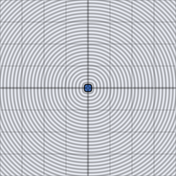

# sdf_op_intersect_smooth

Smoothly blended intersection: like `sdf_op_intersect`, but the join
where the two shapes' boundaries cross is a smooth fillet of radius `k`
instead of a sharp crease.

## Visualization

Rendered via the chunk-preview harness's synthesized grayscale field —
the same `d2_sdf_circle` (radius `0.22`, `x = -0.13`) / `d2_sdf_box`
(half-extents `0.16`, `x = 0.15`) input pair as `sdf_op_intersect`'s
preview, composed with `sdf_op_intersect_smooth( ·, ·, 0.05 )` instead.
Raw result written straight to `vec3f( value )`, clamped to `[0, 1]`,
at `preview_scale = 8`. Compare to `sdf_op_intersect`'s sharp lens — the
overlap region's corners here are rounded off instead of meeting at a
point.

This demo is now wired in as a permanent `sdf_op_intersect_smooth_preview` export, so the chunk is directly previewable via `sch preview sdf_op_intersect_smooth` — no wrapper file needed.

## Parameters

| Field | Value |
|---|---|
| `name` | `sdf_op_intersect_smooth` |
| `description` | Smoothly blended intersection of two signed distances with blend radius k. |
| `tags` | `category:sdf, technique:operator` |
| `stage` | — (plain callable function, not an entry point) |
| `depends_on` | `d2_sdf_circle`, `d2_sdf_box` |
| `export` | `fn sdf_op_intersect_smooth(d1: f32, d2: f32, k: f32) -> f32`, `fn sdf_op_intersect_smooth_preview(p: vec2f, circle_offset_x: f32, circle_radius: f32, box_offset_x: f32, box_half_extent: f32, blend_radius: f32) -> f32` |

## Nuances

- `k -> 0` converges to plain `sdf_op_intersect`.
- Completes the smooth-operator trio with `sdf_op_union_smooth` and
  `sdf_op_subtract_smooth` — all three share the same `h`-blend-factor
  structure, differing only in which distances are negated/mixed.
- Like its sharp counterpart, not associative when chaining three or
  more shapes — grouping order changes the result.

## Relatives

- **Depends on:** [`d2_sdf_circle`](../d2_sdf_circle/readme.md), [`d2_sdf_box`](../d2_sdf_box/readme.md).
- **Depended on by:** none yet.
- **Collection index:** [shader/](../readme.md)
- **Bundled by:** [`shader_chunks_core`](../../module/shader/shader_chunks_core/readme.md)
- **Inspect/compose via CLI:** [`shader_chunks`](../../module/shader/shader_chunks/readme.md)
  (`sch get sdf_op_intersect_smooth`, `sch tree sdf_op_intersect_smooth`)
- **Consumers:** none yet.
