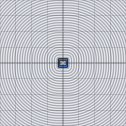

# sdf_op_onion

Turns any filled signed distance field into a hollow shell of the given
`thickness` — like peeling a layer off an onion, hence the name. Repeated
application produces concentric shells.

## Visualization

Rendered via the chunk-preview harness's synthesized grayscale field:
the wrapper applies `sdf_op_onion( ·, 0.045 )` to `d2_sdf_box( p, vec2f(
0.26, 0.2 ) )`'s value, writing the (unsigned) result straight to
`vec3f( value )`, clamped to `[0, 1]`, at `preview_scale = 8`. A dark
rectangular-frame valley traces the box's original outline — same
"hollow shell" style as `d2_sdf_ring`'s field, but derived here from any
input shape's distance rather than a circle-specific closed form.

This demo is now wired in as a permanent `sdf_op_onion_preview` export, so the chunk is directly previewable via `sch preview sdf_op_onion` — no wrapper file needed.

## Parameters

| Field | Value |
|---|---|
| `name` | `sdf_op_onion` |
| `description` | Turns a filled signed distance field into a hollow shell of the given thickness. |
| `tags` | `category:sdf, technique:operator` |
| `stage` | — (plain callable function, not an entry point) |
| `depends_on` | `d2_sdf_box` |
| `export` | `fn sdf_op_onion(d: f32, thickness: f32) -> f32`, `fn sdf_op_onion_preview(p: vec2f, box_half_extent_x: f32, box_half_extent_y: f32, thickness: f32) -> f32` |

## Nuances

- Applied to `d2_sdf_circle`, exactly reproduces `d2_sdf_ring`'s `abs`
  structure — `d2_sdf_ring` is `sdf_op_onion` with `thickness = 0` fused
  into a single closed form for that one shape.
- Chaining `sdf_op_onion` twice (with a second, larger `thickness`)
  produces two concentric shells — a cheap way to get nested-ring/layered
  looks from a single base primitive.
- The shell is centered on the original zero-contour: half the shell sits
  inside the original shape, half outside, symmetric around `thickness`.

## Relatives

- **Depends on:** [`d2_sdf_box`](../d2_sdf_box/readme.md).
- **Depended on by:** none yet.
- **Collection index:** [shader/](../readme.md)
- **Bundled by:** [`shader_chunks_core`](../../module/shader/shader_chunks_core/readme.md)
- **Inspect/compose via CLI:** [`shader_chunks`](../../module/shader/shader_chunks/readme.md)
  (`sch get sdf_op_onion`, `sch tree sdf_op_onion`)
- **Consumers:** none yet.
