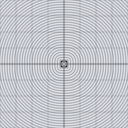

# sdf_op_subtract

Sharp subtraction: carves shape `d1` out of shape `d2`. Dimension-agnostic,
like every `sdf_op_*` chunk — operates on already-computed `f32` distances.

## Visualization

Rendered via the chunk-preview harness's synthesized grayscale field:
the wrapper composes `sdf_op_subtract( d1, d2 )` from two offset 2D
primitives — `d1 = d2_sdf_circle` (radius `0.22`, centered at `x =
-0.13`) as the cutter, `d2 = d2_sdf_box` (half-extents `0.16`, centered
at `x = 0.15`) as the base — and writes the raw result straight to
`vec3f( value )`, clamped to `[0, 1]`, at `preview_scale = 8`. The
box's silhouette shows a circular bite carved out of its left side,
exactly where the circle overlapped it.

This demo is now wired in as a permanent `sdf_op_subtract_preview` export, so the chunk is directly previewable via `sch preview sdf_op_subtract` — no wrapper file needed.

## Parameters

| Field | Value |
|---|---|
| `name` | `sdf_op_subtract` |
| `description` | Sharp subtraction of shape d1 from shape d2 (carves d1 out of d2). |
| `tags` | `category:sdf, technique:operator` |
| `stage` | — (plain callable function, not an entry point) |
| `depends_on` | `d2_sdf_circle`, `d2_sdf_box` |
| `export` | `fn sdf_op_subtract(d1: f32, d2: f32) -> f32`, `fn sdf_op_subtract_preview(p: vec2f, circle_offset_x: f32, circle_radius: f32, box_offset_x: f32, box_half_extent: f32) -> f32` |

## Nuances

- Argument order matters and is easy to get backwards: `d1` is the shape
  *removed*, `d2` is the shape *kept minus d1* — `sdf_op_subtract(hole,
  block)`, not the other way around.
- Not commutative, unlike `sdf_op_union`/`sdf_op_intersect` — swapping
  arguments changes the result shape entirely.
- `max(-d1, d2)` — negating `d1` flips its inside/outside, then
  intersecting with `d2` keeps only the region outside the removed shape.

## Relatives

- **Depends on:** [`d2_sdf_circle`](../d2_sdf_circle/readme.md), [`d2_sdf_box`](../d2_sdf_box/readme.md).
- **Depended on by:** none yet.
- **Collection index:** [shader/](../readme.md)
- **Bundled by:** [`shader_chunks_core`](../../module/shader/shader_chunks_core/readme.md)
- **Inspect/compose via CLI:** [`shader_chunks`](../../module/shader/shader_chunks/readme.md)
  (`sch get sdf_op_subtract`, `sch tree sdf_op_subtract`)
- **Consumers:** none yet.
