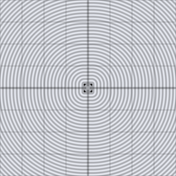

# sdf_op_subtract_smooth

Smoothly blended subtraction: like `sdf_op_subtract`, but the carved
edge is a smooth fillet of radius `k` instead of a sharp crease.

## Visualization

Rendered via the chunk-preview harness's synthesized grayscale field —
the same `d1 = d2_sdf_circle` (radius `0.22`, `x = -0.13`) / `d2 =
d2_sdf_box` (half-extents `0.16`, `x = 0.15`) input pair as
`sdf_op_subtract`'s preview, composed with `sdf_op_subtract_smooth( d1,
d2, 0.05 )` instead. Raw result written straight to `vec3f( value )`,
clamped to `[0, 1]`, at `preview_scale = 8`. Compare to
`sdf_op_subtract`'s sharp bite — the carved edge here is a smooth
concave fillet instead of a crisp circular arc.

This demo is now wired in as a permanent `sdf_op_subtract_smooth_preview` export, so the chunk is directly previewable via `sch preview sdf_op_subtract_smooth` — no wrapper file needed.

## Parameters

| Field | Value |
|---|---|
| `name` | `sdf_op_subtract_smooth` |
| `description` | Smoothly blended subtraction of shape d1 from shape d2 with blend radius k. |
| `tags` | `category:sdf, technique:operator` |
| `stage` | — (plain callable function, not an entry point) |
| `depends_on` | `d2_sdf_circle`, `d2_sdf_box` |
| `export` | `fn sdf_op_subtract_smooth(d1: f32, d2: f32, k: f32) -> f32`, `fn sdf_op_subtract_smooth_preview(p: vec2f, circle_offset_x: f32, circle_radius: f32, box_offset_x: f32, box_half_extent: f32, blend_radius: f32) -> f32` |

## Nuances

- Same argument-order caveat as `sdf_op_subtract`: `d1` is removed from
  `d2`, not the reverse.
- `k -> 0` converges to plain `sdf_op_subtract`.
- Commonly used for carved/eroded-looking cutouts — a bullet hole or worn
  socket reads more natural with a soft blended edge than a sharp one.

## Relatives

- **Depends on:** [`d2_sdf_circle`](../d2_sdf_circle/readme.md), [`d2_sdf_box`](../d2_sdf_box/readme.md).
- **Depended on by:** none yet.
- **Collection index:** [shader/](../readme.md)
- **Bundled by:** [`shader_chunks_core`](../../module/shader/shader_chunks_core/readme.md)
- **Inspect/compose via CLI:** [`shader_chunks`](../../module/shader/shader_chunks/readme.md)
  (`sch get sdf_op_subtract_smooth`, `sch tree sdf_op_subtract_smooth`)
- **Consumers:** none yet.
