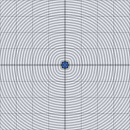

# sdf_op_union

Sharp union of two signed distances: the nearer surface wins everywhere.
Dimension-agnostic — operates purely on the `f32` distance values any
`d2_sdf_*`/`d3_sdf_*` primitive returns, so one function serves both 2D
and 3D scenes.

## Visualization

Rendered via the chunk-preview harness's synthesized grayscale field:
since `sdf_op_union` itself takes two already-computed distances (not a
point), the wrapper composes it from two offset 2D primitives —
`d2_sdf_circle` (radius `0.22`, centered at `x = -0.13`) and
`d2_sdf_box` (half-extents `0.16`, centered at `x = 0.15`) — and writes
`sdf_op_union`'s raw result straight to `vec3f( value )`, clamped to
`[0, 1]`, at `preview_scale = 8`. A single seamless black silhouette
covers both shapes' extent — the sharp crease where they meet is
visible in the brightness contours, but the zero level-set itself shows
no trace of which input was nearer.

This demo is now wired in as a permanent `sdf_op_union_preview` export, so the chunk is directly previewable via `sch preview sdf_op_union` — no wrapper file needed.

## Parameters

| Field | Value |
|---|---|
| `name` | `sdf_op_union` |
| `description` | Sharp union of two signed distances — the nearer surface wins. |
| `tags` | `category:sdf, technique:operator` |
| `stage` | — (plain callable function, not an entry point) |
| `depends_on` | `d2_sdf_circle`, `d2_sdf_box` |
| `export` | `fn sdf_op_union(d1: f32, d2: f32) -> f32`, `fn sdf_op_union_preview(p: vec2f, circle_offset_x: f32, circle_radius: f32, box_offset_x: f32, box_half_extent: f32) -> f32` |

## Nuances

- No `d2_`/`d3_` prefix: it takes two already-computed distances, not
  points, so the same function composes any mix of 2D and 3D primitives.
- Sharp — the join has a crease (a `C0`-continuous but not smooth seam)
  where the two surfaces cross; use `sdf_op_union_smooth` for a blended
  fillet instead.
- Associative and commutative — folding a list of shapes with repeated
  `sdf_op_union` calls in any order gives the same result.

## Relatives

- **Depends on:** [`d2_sdf_circle`](../d2_sdf_circle/readme.md), [`d2_sdf_box`](../d2_sdf_box/readme.md).
- **Depended on by:** none yet.
- **Collection index:** [shader/](../readme.md)
- **Bundled by:** [`shader_chunks_core`](../../module/shader/shader_chunks_core/readme.md)
- **Inspect/compose via CLI:** [`shader_chunks`](../../module/shader/shader_chunks/readme.md)
  (`sch get sdf_op_union`, `sch tree sdf_op_union`)
- **Consumers:** none yet.
