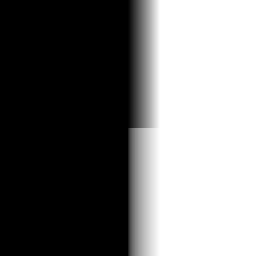

# srgb

Linear-to-sRGB and sRGB-to-linear color conversions, piecewise-exact. Both
directions of the IEC 61966-2-1 transfer curve in one chunk: encode linear
working-space color for display, or decode authored sRGB constants into
linear space for physically sensible math.

## Visualization

Rendered via the chunk-preview harness's synthesized field: the top half
(`p.y > 0`) shows the raw ramp `vec3f( p.x )`, the bottom half shows
`linear_to_srgb( vec3f( p.x ) )`, written directly as RGB, clamped to
`[0, 1]`, at `preview_scale = 8`. The bottom half is visibly brighter
through the midtones — the exact lightening the encode applies so linear
light survives a display's decoding gamma. Directly previewable via
`sch preview srgb`.

## Parameters

| Field | Value |
|---|---|
| `name` | `srgb` |
| `description` | Linear-to-sRGB and sRGB-to-linear color conversions, piecewise-exact. |
| `tags` | `category:color` |
| `stage` | — (plain callable function, not an entry point) |
| `depends_on` | — (no dependencies; leaf chunk) |
| `export` | `fn linear_to_srgb(color: vec3f) -> vec3f`, `fn srgb_to_linear(color: vec3f) -> vec3f`, `fn srgb_preview(p: vec2f) -> vec3f` |

## Nuances

- Exact piecewise curve — linear segment below the `0.0031308` /
  `0.04045` cutoffs, `1/2.4` (resp. `2.4`) power above — matching the
  GLSL renderer's `to_srgb.frag`, with the exponent written as `1.0 / 2.4`
  rather than a `0.41666` literal. Round-tripping the two exports is
  identity to float precision.
- Not a plain `pow( c, 1.0 / 2.2 )` gamma: the linear toe near black is
  the part cheap approximations get wrong.
- The transfer applies to color; alpha is never converted.
- Skip the encode entirely when rendering into an `*Srgb` texture format —
  the hardware encodes on write, and applying this on top double-brightens
  (this collection's previews render to plain `Rgba8Unorm` for exactly
  that reason).

## Relatives

- **Depends on:** none — leaf primitive.
- **Depended on by:** none yet.
- **Collection index:** [shader/](../readme.md)
- **Bundled by:** [`shader_chunks_core`](../../module/shader/shader_chunks_core/readme.md)
- **Inspect/compose via CLI:** [`shader_chunks`](../../module/shader/shader_chunks/readme.md)
  (`sch get srgb`, `sch tree srgb`)
- **Consumers:** none yet — the WGSL twin of the GLSL renderer's
  `post_processing/to_srgb.frag`.
