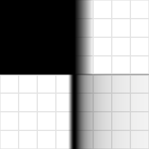

# tonemap_aces

ACES filmic tone map from HDR to `[0, 1]`, the Hill fit with
three.js-style pre-exposure. Constants ported verbatim from this
workspace's GLSL renderer (`tonemapping/aces.frag`), so WebGPU and WebGL2
paths grade identically.

## Visualization

Rendered via the chunk-preview harness's synthesized field: the top half
(`p.y > 0`) shows the raw ramp `vec3f( p.x )` clamped to `[0, 1]`, the
bottom half shows `tonemap_aces( vec3f( p.x ), 1.0 )`, written directly as
RGB at `preview_scale = 8`. The top half slams into flat white as `p.x`
exceeds 1; the bottom half rolls off through a long filmic shoulder that
keeps gradation across the full drifting range. Drag `exposure` above `1`
to push more of the ramp into the shoulder, or below `1` to hold more of
it in the linear toe. Directly previewable via `sch preview tonemap_aces`.

## Parameters

| Field | Value |
|---|---|
| `name` | `tonemap_aces` |
| `description` | ACES filmic tone map from HDR to [0, 1], the Hill fit with three.js-style pre-exposure. |
| `tags` | `category:color` |
| `stage` | — (plain callable function, not an entry point) |
| `depends_on` | — (no dependencies; leaf chunk) |
| `export` | `fn tonemap_aces(color: vec3f, exposure: f32) -> vec3f`, `fn tonemap_aces_preview(p: vec2f, exposure: f32) -> vec3f` |

## Nuances

- Stephen Hill's fit of the ACES RRT+ODT: input matrix → rational
  sigmoid → output matrix. The `1.0 / 0.6` pre-exposure matches
  three.js's `ACESFilmicToneMapping` (and this repo's GLSL original) —
  omit it and everything renders noticeably darker than the WebGL2 path.
  This fixed `0.6` is left untouched, same as the matrices below.
- The GLSL source's matrices carry over unchanged: GLSL `mat3` and WGSL
  `mat3x3f` constructors are both column-major, so the number layout is
  identical — do not "fix" the apparent transposition.
- Input must be **linear HDR**; the output is display-linear in
  `[0, 1]`. Order in a post chain: exposure → this → sRGB encode.
- The fit is applied per rgb triple with channel crosstalk from the
  matrices — brights desaturate toward white. That is the filmic look,
  not a bug.
- `exposure` (`//@ param:`, range `[0, 2]`) is a user-facing multiplier on
  `hdr`, applied *before* the fit's own fixed `0.6` pre-scale — the same
  role three.js gives its separate `toneMappingExposure` uniform, kept
  here as one combined knob rather than a second chunk-level constant.
  `1.0` (this range's midpoint) reproduces the original, unexposed output
  exactly; the Hill fit's matrices and sigmoid coefficients themselves
  stay fixed regardless of `exposure`, since those must match the GLSL
  original verbatim for the two renderers to grade identically.

## Relatives

- **Depends on:** none — leaf primitive.
- **Depended on by:** none yet.
- **Collection index:** [shader/](../readme.md)
- **Bundled by:** [`shader_chunks_core`](../../module/shader/shader_chunks_core/readme.md)
- **Inspect/compose via CLI:** [`shader_chunks`](../../module/shader/shader_chunks/readme.md)
  (`sch get tonemap_aces`, `sch tree tonemap_aces`)
- **Consumers:** none yet — the WGSL twin of the GLSL renderer's
  `tonemapping/aces.frag`.
