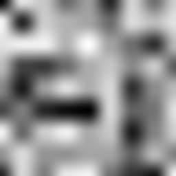

# value_noise

Bilinear-interpolated value noise sampled at a 2D point, in `[0, 1)`.

## Visualization

256×256, evaluated over the continuous domain `[0, 8) × [0, 8)` (32 px per
unit cell), mapped to grayscale. Compare against
[`hash21`](../hash21/readme.md)'s pure static: this chunk calls `hash21` at
the four integer lattice corners surrounding each sample point and blends
them, which is what turns uncorrelated noise into the smooth, blobby pattern
shown here. The faint grid-cell boundaries still visible are an inherent
property of value noise (only the four corner values are randomized, not a
gradient) — not a bug in this implementation. Drag `seed` away from `0` for
a different arrangement of blobs entirely, same lattice.

## Parameters

| Field | Value |
|---|---|
| `name` | `value_noise` |
| `description` | Bilinear-interpolated value noise sampled at a 2D point, in `[0, 1)`. |
| `tags` | `category:noise` |
| `stage` | — (plain callable function, not an entry point) |
| `depends_on` | `hash21` |
| `export` | `fn value_noise(p: vec2f, seed: f32) -> f32` |

## Nuances

- Classic bilinear value noise: `i = floor(p)` locates the surrounding
  lattice cell, then [`hash21`](../hash21/readme.md) is called at all four
  corners (`i`, `i+(1,0)`, `i+(0,1)`, `i+(1,1)`).
- The blend weight `u = f*f*(3-2*f)` (`f = fract(p)`) is the smoothstep /
  Hermite ease curve — **not** a plain linear interpolation. This is what
  keeps the result continuous in its first derivative across cell
  boundaries; a plain linear `f` would show visible creases at every
  integer grid line.
- Output stays within the same `[0, 1)` range as `hash21`, since a weighted
  blend (`mix`) of values already in `[0, 1)` can never leave that range.
- `seed` (`//@ param:`, range `[-50, 50]`) offsets the integer lattice
  coordinate fed into each corner's `hash21`, reshuffling which value lands
  at which corner — same technique as `voronoi`'s and `gradient_noise`'s
  `seed`. `0` (this range's midpoint) reproduces the original, unseeded
  pattern exactly. Panning `p` itself would only relabel the same corner →
  value mapping; offsetting the hashed coordinate genuinely decorrelates it.

## Relatives

- **Depends on:** [`hash21`](../hash21/readme.md) (hashes the four lattice
  corners around each sample point).
- **Depended on by:** [`fbm3`](../fbm3/readme.md) (calls this chunk three
  times at increasing frequency).
- **Collection index:** [shader/](../readme.md)
- **Bundled by:** [`shader_chunks_core`](../../module/shader/shader_chunks_core/readme.md)
- **Inspect/compose via CLI:** [`shader_chunks`](../../module/shader/shader_chunks/readme.md)
  (`sch get value_noise`, `sch tree value_noise`)
- **Consumer:** [`examples/orrery/webgpu`](../../examples/orrery/webgpu/readme.md)
