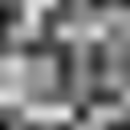

# value_noise3

Trilinear-interpolated value noise sampled at a 3D point, in `[0, 1)`. The
3D counterpart of [`value_noise`](../value_noise/readme.md): eight
[`hash13`](../hash13/readme.md)ed lattice corners blended with a smooth
fade. Sample it at `vec3f( uv * scale, time )` for a cheap 2D field that
genuinely evolves instead of scrolling.

## Visualization

Rendered via the chunk-preview harness's synthesized grayscale
field: `value_noise3( vec3f( p, 1.7 ) )` — a fixed-`z` slice
through the 3D field — is written straight to `vec3f( value )`,
clamped to `[0, 1]`, at `preview_scale = 8`. Smooth blobs like the
2D chunk's preview; a different `z` slides through entirely new
blobs. Directly previewable via `sch preview value_noise3`.

## Parameters

| Field | Value |
|---|---|
| `name` | `value_noise3` |
| `description` | Trilinear-interpolated value noise sampled at a 3D point, in `[0, 1)`. |
| `tags` | `category:noise` |
| `stage` | — (plain callable function, not an entry point) |
| `depends_on` | `hash13` |
| `export` | `fn value_noise3(p: vec3f) -> f32`, `fn value_noise3_preview(p: vec2f) -> f32` |

## Nuances

- Uses the same cubic `f * f * ( 3.0 - 2.0 * f )` fade as its 2D sibling —
  deliberately, so the two chunks stay visually consistent per octave;
  `gradient_noise` is the one that upgrades to a quintic fade.
- Eight hash evaluations per sample (vs four in 2D) — roughly twice the
  cost of `value_noise`; worth it only when the third axis is actually
  used (animation, volume slicing).
- Corner naming `c000..c111` follows binary xyz offsets; the two bilinear
  layers (`z0`, `z1`) mix along z last.

## Relatives

- **Depends on:** [`hash13`](../hash13/readme.md) (hashes the eight cell
  corners).
- **Depended on by:** none yet.
- **Collection index:** [shader/](../readme.md)
- **Bundled by:** [`shader_chunks_core`](../../module/shader/shader_chunks_core/readme.md)
- **Inspect/compose via CLI:** [`shader_chunks`](../../module/shader/shader_chunks/readme.md)
  (`sch get value_noise3`, `sch tree value_noise3`)
- **Consumers:** none yet.
