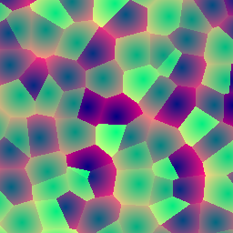

# voronoi

Cellular (Worley) F1 distance and cell id at a 2D point. Each unit lattice
cell holds one [`hash22`](../hash22/readme.md)-jittered feature point; the
function returns the distance to the nearest one plus a stable per-cell
identifier — organic cells, cracked surfaces, starfields with guaranteed
minimum spacing.

## Visualization

Rendered via the chunk-preview harness's synthesized grayscale field:
`voronoi_preview( p, 0.5 ) = voronoi( p, 0.5 ).x` — written straight to
`vec3f( value )`, clamped to `[0, 1]`, at `preview_scale = 8`. Drag the
`jitter` slider to `0` for a perfectly regular grid of feature points, or
to `1` for this chunk's original, fully-randomized look. Directly
previewable via `sch preview voronoi`.

## Parameters

| Field | Value |
|---|---|
| `name` | `voronoi` |
| `description` | Cellular (Worley) F1 distance and cell id at a 2D point. |
| `tags` | `category:noise`, `technique:cellular` |
| `stage` | — (plain callable function, not an entry point) |
| `depends_on` | `hash22` |
| `export` | `fn voronoi(p: vec2f, jitter: f32) -> vec2f`, `fn voronoi_preview(p: vec2f, jitter: f32) -> f32` |

## Nuances

- `jitter` (`//@ param:`, range `[0, 1]`) scales the per-cell `hash22`
  offset: `0` collapses every feature point onto its own grid corner (a
  perfectly regular lattice); `1` reproduces this chunk's original,
  fully-randomized behavior. The range is capped at `1` — not just
  aesthetic — see the next bullet.
- The 3×3 neighborhood scan is exact, not approximate: `jitter` cannot
  exceed `1` and `hash22` is `[0, 1)`, so the offset feature point can
  never land outside the fixed 3×3 search window.
- Squared distances are compared in the loop; the single `sqrt` happens
  once at the end — the returned `.x` is true euclidean distance.
- `.y` is the winning cell's `rnd.x`, the raw (un-jittered) `hash22`
  x-channel — constant across the whole cell, so it works as a per-cell
  random seed (color, brightness, phase) independent of `jitter`. It is an
  id, not a spatial quantity.
- F1 near cell corners can slightly exceed 1 in `p` units; treat the range
  as ~`[0, 1.2]` when normalizing for display.

## Relatives

- **Depends on:** [`hash22`](../hash22/readme.md) (per-cell feature-point
  jitter and the id channel).
- **Depended on by:** none yet.
- **Collection index:** [shader/](../readme.md)
- **Bundled by:** [`shader_chunks_core`](../../module/shader/shader_chunks_core/readme.md)
- **Inspect/compose via CLI:** [`shader_chunks`](../../module/shader/shader_chunks/readme.md)
  (`sch get voronoi`, `sch tree voronoi`)
- **Consumers:** none yet.
